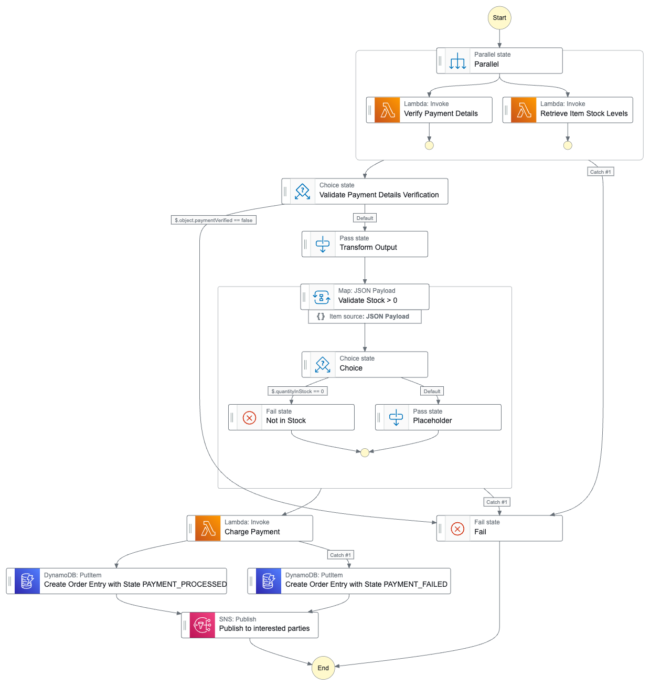

# Order Processing Workflow with AWS Step Functions
This repository contains an order processing workflow developed using AWS Step Functions. The bulk was built as part of the excellent [Be A Better Dev Step Functions Masterclass course](https://courses.beabetterdev.com/courses/aws-step-functions-masterclass), which I took to further develop my AWS skills, and I've added some extra functionality and error handling as well. 

## Outline
The idea was that we work for a retail outlet and need to build a workflow that takes an order as input (including the items ordered, payment details, etc.) and processes it by implementing the following logic.
1. Validate payment details and check that every item in the order is in stock.
2. Charge the customer.
3. Write the order details to a table.
4. Notify interested parties (e.g. the customer) of success or failure of the order.

The architecture is given below and the code is contained in `workflow.asl.json`.

