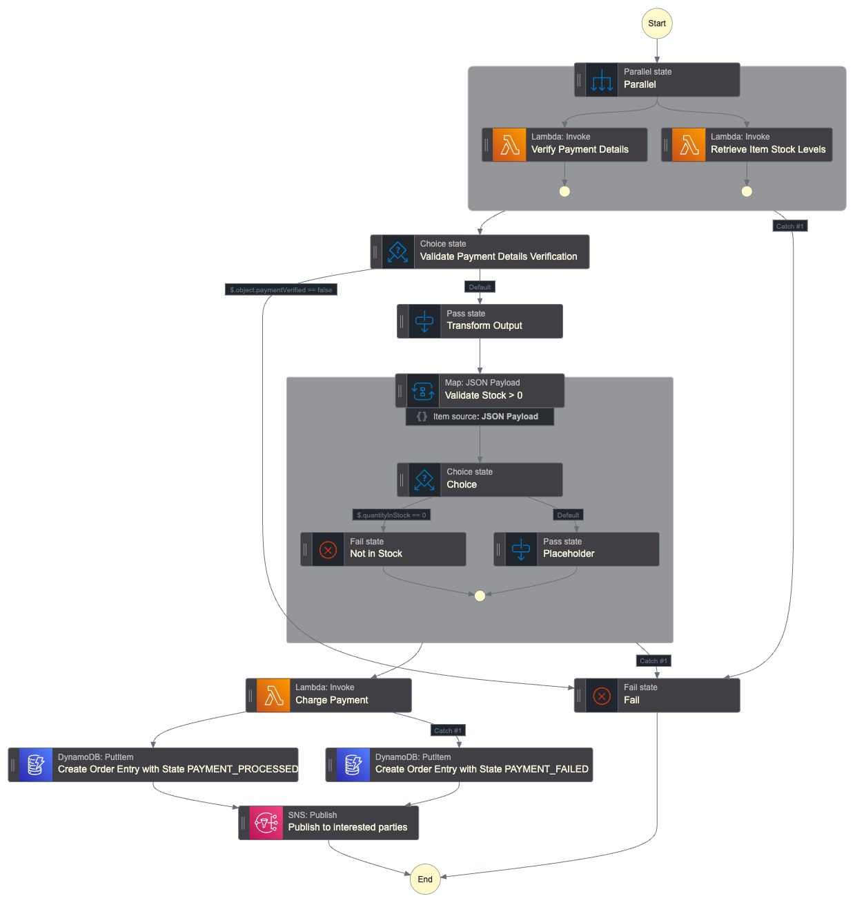
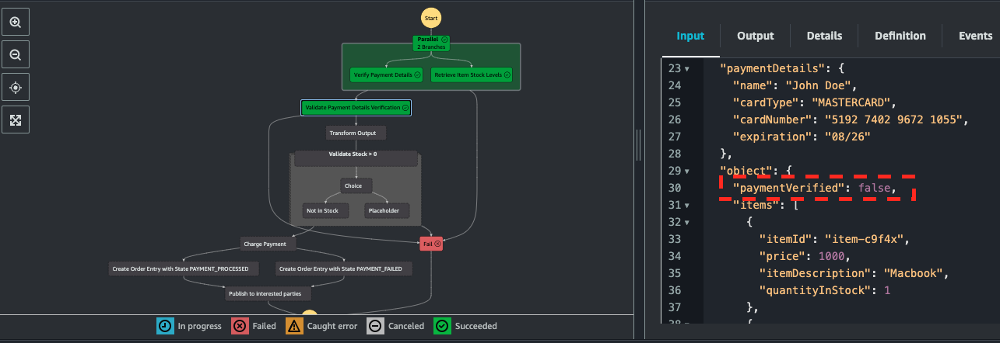
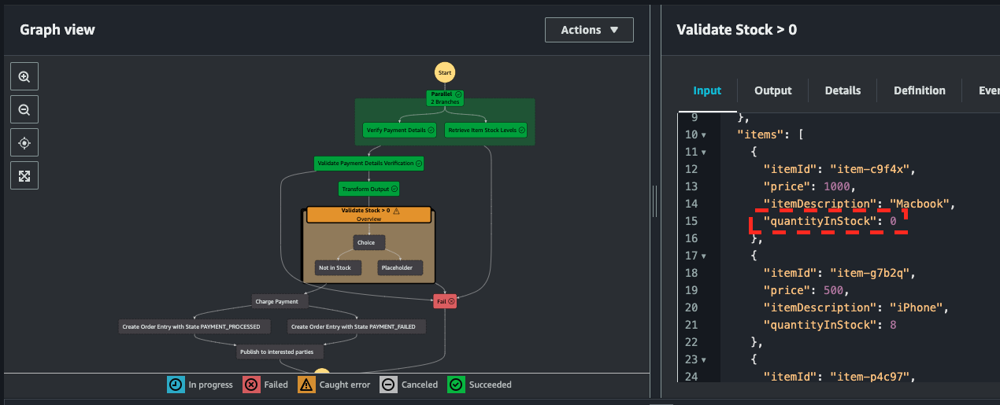
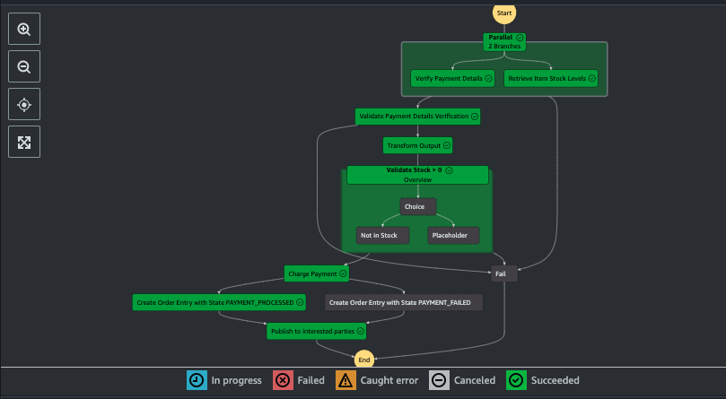
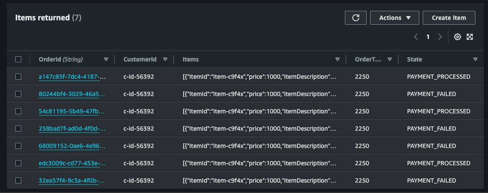

# Order Processing Workflow with AWS Step Functions
This repository contains an order processing workflow developed using AWS Step Functions (SFs). The bulk was built as part of the excellent [Be A Better Dev Step Functions Masterclass course](https://courses.beabetterdev.com/courses/aws-step-functions-masterclass), which I took to further develop my AWS skills, and I've added some extra functionality and error handling as well. As a further learning experience, I implemented the same workflow using CDK, which you can find [here](https://github.com/d-lazenby/order-processing-workflow-cdk).

## Outline
The idea was that we work for a retail outlet and need to build a workflow that takes an order as input (including the items ordered, payment details, etc.) and processes it by implementing the following logic.
1. Validate payment details and check that every item in the order is in stock.
2. Charge the customer.
3. Write the order details to a table.
4. Notify interested parties (e.g. the customer) of success or failure of the order.

The directory `lambda` contains the Python code for the three Lambda functions, which were enabled with a Python 3.12 runtime. The architecture is given below and the Amazon States Language representation is contained in `workflow.asl.json`. 

### A note on simultating the workflow and permissions
To simulate error handling in the workflow, randomnesss has been coded into the Lambda functions. Specifically, payment details verification will fail one in four times; each item will be out of stock one in ten times; and charging the customer will fail one in four times. 

For simplicity the SF was assigned a role with much broader permissions than needed to carry out this task – in production these should be much more restrictive.

### Input
The input to the SF is a nested JSON containing the following. 
* `orderContents`: 
    * `items`: array with each element containing a JSON with the keys `itemId`, `price` and `itemDescription`.
* `orderTotal`: sum of all `price` keys in `items`.
* `customerId`: unique customer identifier.
* `paymentDetails`: contains JSON with keys `name`, `cardType`, `cardNumber` and `expiration`.

An example input is contained in `input.json`.

### Prerequisites
As well as the three Lambda functions, the workflow writes to a DynamoDB table and publishes to an SNS Topic, and these were set up before implementing the application in the Workflow Studio. 

The schema for the CustomerOrders table is as follows.

| Header | Type | Notes |
| :--- | :---: | :--- |
| OrderId | STRING | UUID |
| State | STRING | PROCESSED or FAILED|
| CustomerId | STRING | Unique to customer |
| OrderTotal | NUMERIC | Cost of the order |
| Items | ARRAY[JSON] | All items in the order |

For simplicity, no subscribers were added to the Topic but it is easy to set this up for a real use-case.

## Workflow

### Parallel State
This contains two Lambda invocations to be carried out in parallel; if either fails, we move to the Fail stae and the SF stops. The first verifies the payment details and adds a key `paymentVerified` with an associated boolean indicating the result of the verification. The second retrieves the stock levels for each item in the order and adds a key `quantityInStock` with an associated integer showing the stock levels. 

### Error handling for payment details and stock levels
To begin, the payload is passed to a Choice state that simply checks the value of `paymentVerified`: if False we move to the Fail state and the SF stops, otherwise we move to a Pass state that does some minor tidying of the payload before passing it on. 

The next step uses a Map state to iterate through the payload `items` and check each `quantityInStock`: if any of these are zero, the "Not in Stock" fail state activates and we exit. Otherwise, we move on to charging the customer. 

### Charging, writing to DynamoDB and Publishing to SNS
The third Lambda charges the customer and contains a PaymentError exception. If the latter is raised, this is caught by the Lambda function and an order entry with State "PAYMENT_FAILED" is added to the Orders Table. Otherwise, an entry with Status "PAYMENT_PROCESSED" is added. At thist point a UUID `orderId` is added as an identifier and finally the result is published to the SNS Topic. 

## Testing
The workflow was tested multiple times to ensure that all routes could be taken depending on what the input JSON contained. Below are screenshots of executions with two different outcomes: (1) failure due to payment details not being validated and (2) failure due to stock levels of one or more items being zero. The red boxes on the right-hand side highlight the element of the input that caused the failure in each case.

Below is an example where no errors were triggered and the workflow completed OK; in this case the customer payment was also successful.

When the Charge Payment Lambda is invoked an order is written to the CustomerOrders table with Status successful/failed depending on if the charging process completed OK. Below is a screenshot of the table populated with some of the test results.  

